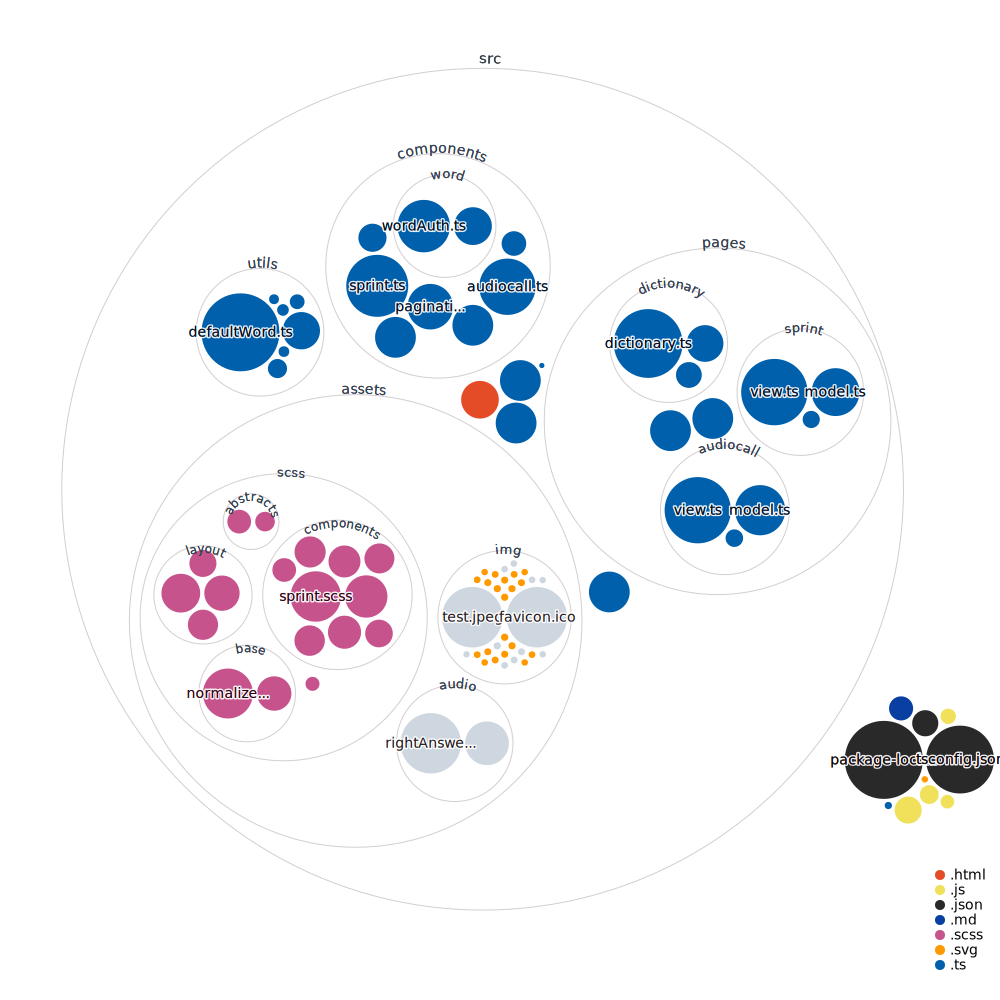

# RS Lang

RS Lang — это SPA для изучения английского языка, разработано в соответствии с [заданием](https://github.com/rolling-scopes-school/tasks/blob/master/tasks/stage-2/rs-lang/rslang.md). Содержит главную страницу, учебник, 2 мини-игры, страницу статистики.

## Технические особенности
 - *TypeScript*, *SCSS*, *HTML*
 - cборщик *Webpack*
 - линтер *ESlint* *(eslint-airbnb-config)*
 - система контроля версий: *Git*
 - сервис совместной разработки: *GitHub*
 - паттерны: MVC, singleton

### Бэкенд
[Бэкенд](https://github.com/rolling-scopes-school/react-rslang-be) приложения взят из [технического задания](https://github.com/rolling-scopes-school/tasks/blob/master/tasks/stage-2/rs-lang/rslang.md) без изменений. 

[Деплой](https://azozulya.github.io/rslang/) на gh-pages

## Структура проекта

